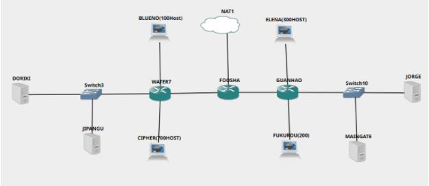

# Jarkom-Modul-5-C08-2021

Berikut adalah laporan resmi Praktikum Jaringan Komputer Modul 5 tahun 2021

Anggota Kelompok C08 :

- 05111940000100 - Muhammad Raihan
- 05111940000208 - Inez Yulia Amanda
- 05111940000209 - Refaldyka Galuh Pratama



## CIDR

Subnetting menggunakan metode CIDR dengan jumlah subnet 8 buah. Untuk pohon perhitungan CIDR dapat dilihat [disini](https://miro.com/app/board/uXjVOdKLcVA=/). Sedangkan hasil pembagian subnet sebagai berikut:


### Tahap Persiapan
Setelah meng-assign IP address ke masing-masing node pada topologi (Selain Client), Kami akan melakukan routing dari foosha ke seluruh subnet pada topologi.


Lalu, untuk DHCP relay, arahkan semua request ke IP Jipangu (10.18.4.131) sebagai DHCP Server pada topologi. 

Selanjutnya, lakukan pengaturan IP Client pada node Jipangu


Hidupkan DNS Forwarder dan arahkan ke IP 192.168.122.1 agar dapat tersambung ke internet.

###

## Soal
1. Mengkonfigurasi Foosha menggunakan iptables agar topologi dapat mengakses keluar, tetapi tidak menggunakan MASQUERADE.

2. Mendrop semua akses HTTP dari luar Topologi pada server yang merupakan DHCP Server dan DNS Server demi menjaga keamanan.

3. Membatasi DHCP dan DNS Server hanya boleh menerima maksimal 3 koneksi ICMP secara bersamaan menggunakan iptables, selebihnya didrop.

Membatasi akses ke Doriki yang berasal dari subnet Blueno, Cipher, Elena dan Fukuro dengan beraturan sebagai berikut

4. Akses dari subnet Blueno dan Cipher hanya diperbolehkan pada pukul 07.00 - 15.00 pada hari Senin sampai Kamis.

5. Akses dari subnet Elena dan Fukuro hanya diperbolehkan pada pukul 15.01 hingga pukul 06.59 setiap harinya.

Selain itu di reject.

6. Karena memiliki 2 Web Server, Guanhao disetting sehingga setiap request dari client yang mengakses DNS Server akan didistribusikan secara bergantian pada Jorge dan Maingate


## Jawaban 
**Pertama-tama kita setup static internet di Foosha**
```
auto eth0
iface eth0 inet static
    address 192.168.122.25
    netmask 255.255.255.0
    gateway 192.168.122.1
```
**Jawaban Nomor 1**
(*Di Foosha*)
```
iptables -t nat -A POSTROUTING -s 10.18.0.0/20 -o eth0 -j SNAT --to-source 192.168.122.25
```
*Keterangan:*
- ```-t nat```: Menggunakan tabel NAT karena akan mengubah alamat asal dari paket
- ```-A POSTROUTING```: Menggunakan chain POSTROUTING karena mengubah asal paket setelah routing
- ```-s 10.18.0.0/20```: Mendifinisikan alamat asal dari paket yaitu semua alamat IP dari subnet 10.18.0.0/20
- ```-o eth0```: Paket keluar dari eth0 Foosha
- ```-j SNAT```: Menggunakan target SNAT untuk mengubah source atau alamat asal dari paket
- ```--to-s (ip eth0)```: Mendefinisikan IP source, di mana digunakan eth0 Foosha dengan IP 192.168.122.25

**Jawaban Nomor 2**
*(Di Doriki & Jipangu)*
```
iptables -A FORWARD -d 10.18.4.128/29 -i eth0 -p tcp --dport 80 -j DROP
```
*Keterangan:*
- ```-A FORWARD```: Menggunakan chain FORWARD
- ```-p tcp```: Mendefinisikan protokol yang digunakan, yaitu tcp
- ```--dport 80```: Mendefinisikan port yang digunakan, yaitu 80 (HTTP)
- ```-d 10.18.4.128/29```: Mendefinisikan alamat tujuan dari paket (DHCP dan DNS SERVER ) berada pada subnet 10.18.4.128/29
- ```-i eth0```: Paket masuk dari eth0 Foosha
- ```-j DROP```: Paket di-drop

**Jawaban Nomor 3**
*(Di Doriki & Jipangu)*
```
iptables -A INPUT -m state --state ESTABLISHED,RELATED -j ACCEPT
iptables -A INPUT -p icmp -m connlimit --connlimit-above 3 --connlimit-mask 0 -j DROP
```
*Keterangan:*
- ```-A INPUT```: Menggunakan chain INPUT
- ```-p icmp```: Mendefinisikan protokol yang digunakan, yaitu ICMP (ping)
- ```-m connlimit```: Menggunakan rule connection limit
- ```--connlimit-above 3```: Limit yang ditangkap paket adalah di atas 3
- ```--connlimit-mask 0```: Hanya memperbolehkan 3 koneksi setiap subnet dalam satu waktu
- ```-j DROP```: Paket di-drop

**Jawaban Nomor 4**
*(Di Doriki)*

**Batas Akses Doriki Dari Cipher**
```
iptables -A INPUT -s 10.18.4.0/25 -d 10.18.4.128/29 -m time --timestart 07:00 --timestop 15:00 --weekdays Mon,Tue,Wed,Thu -j ACCEPT
iptables -A INPUT -s 10.18.4.0/25 -j REJECT
```
**Batas Akses Doriki Dari Blueno**
```
iptables -A INPUT -s 10.18.0.0/22 -d 10.18.4.128/29 -m time --timestart 07:00 --timestop 15:00 --weekdays Mon,Tue,Wed,Thu -j ACCEPT
iptables -A INPUT -s 10.18.0.0/22 -j REJECT
```
*Keterangan:*
- ```-A INPUT```: Menggunakan chain INPUT
- ```-s 10.18.4.0/25```: Mendifinisikan alamat asal dari paket yaitu IP dari subnet Cipher
- ```-s 10.18.0.0/22```: Mendifinisikan alamat asal dari paket yaitu IP dari subnet Blueno
- ```-d 10.18.4.128/29```: Mendifinisikan alamat tujuan dari paket yaitu IP dari subnet Doriki
- ```-m time```: Menggunakan rule time
- ```--timestart 07:00```: Mendefinisikan waktu mulai yaitu 07:00
- ```--timestop 15:00```: Mendefinisikan waktu berhenti yaitu 15:00
- ```--weekdays Mon,Tue,Wed,Thu```: Mendefinisikan hari yaitu Senin hingga Kamis
- ```-j ACCEPT```: Paket di-accept
- ```-j REJECT```: Paket ditolak

**Jawaban Nomor 5**
*(Di Doriki)*

**Batas Akses Doriki Dari Elena**
```
iptables -A INPUT -s 10.18.10.0/23 -m time --timestart 15:01 --timestop 06:59 -j ACCEPT
iptables -A INPUT -s 10.18.10.0/23 -j REJECT
```
**Batas Akses Doriki Dari Fukurou**
```
iptables -A INPUT -s 10.18.8.0/24 -m time --timestart 15:01 --timestop 06:59 -j ACCEPT
iptables -A INPUT -s 10.18.8.0/24 -j REJECT
```

*Keterangan:*
- ```-A INPUT```: Menggunakan chain INPUT
- ```-s 10.18.10.0/23```: Mendifinisikan alamat asal dari paket yaitu IP dari subnet Elena
- ```-s 10.18.8.0/24```: Mendifinisikan alamat asal dari paket yaitu IP dari subnet Fukurou
- ```-m time```: Menggunakan rule time
- ```--timestart 15:01```: Mendefinisikan waktu mulai yaitu 07:00
- ```--timestop 06:59```: Mendefinisikan waktu berhenti yaitu 15:00
- ```-j ACCEPT```: Paket di-accept
- ```-j REJECT```: Paket ditolak

**Jawaban Nomor 6**
*(Di Guanhao)*
```
iptables -A PREROUTING -t nat -p tcp -d 10.18.4.128 --dport 80 -m statistic --mode nth --every 2 --packet 0 -j DNAT --to-destination  10.18.9.2:80
iptables -A PREROUTING -t nat -p tcp -d 10.18.4.128 --dport 80 -j DNAT --to-destination 10.18.9.3:80
iptables -t nat -A POSTROUTING -p tcp -d 10.18.9.2 --dport 80 -j SNAT --to-source 10.18.4.128:80
iptables -t nat -A POSTROUTING -p tcp -d 10.18.9.3 --dport 80 -j SNAT --to-source 10.18.4.128:80
```

## Testing
**Testing Nomor 1**
- Jalankan Command diatas jika berhasil maka semua node lain bisa tersambung ke NAT

**Testing Nomor 2**
1. Install netcat di server Jipangu dan Doriki: ```apt-get install netcat -y```
2. Pada Jipangu dan Doriki ketikkan: ```nc -l -p 80```
3. Pada Foosha ketikkan: ```nmap -p 80 10.18.4.130``` atau ```nmap -p 80 10.18.4.131```

**Testing Nomor 3**
1. Masuk ke 4 node berbeda apapun
2. Ping ke arah Jipangu/Doriki secara bersamaan

**Testing Nomor 4 dan 5**

Ubah waktu dengan command dibawah pada *Doriki*. Kemudian, lakukan pengetesan dengan ```ping google.com``` pada client yang diperbolehkan aksesnya atau tidak diperbolehkan
1. ```date -s "8 nov 2021 10:00:00"```
2. ```date -s "8 nov 2021 17:00:00"```

**Testing Nomor 6**
1. Pada Guanhao, Jorge, Maingate dan Elena install: ```apt-get install netcat -y```
2. Pada Jorge ketikkan perintah: ```nc -l -p 80```
3. Pada Maingate ketikkan perintah: ```nc -l -p 80```
4. Pada client Elena ketikkan perintah: ```nc 10.18.4.128 80```
5. Ketikkan sembarang pada client Elena, jika sudah hasilnya akan muncul disalah satu webserver
6. ```CTRL+Z``` pada client Elena. kemudian ketikkan perintah: ```nc 10.18.4.128 80``` lagi pada Elena.
7. Ketikkan sembarang lagi, hasilnya akan keluar di server kedua
